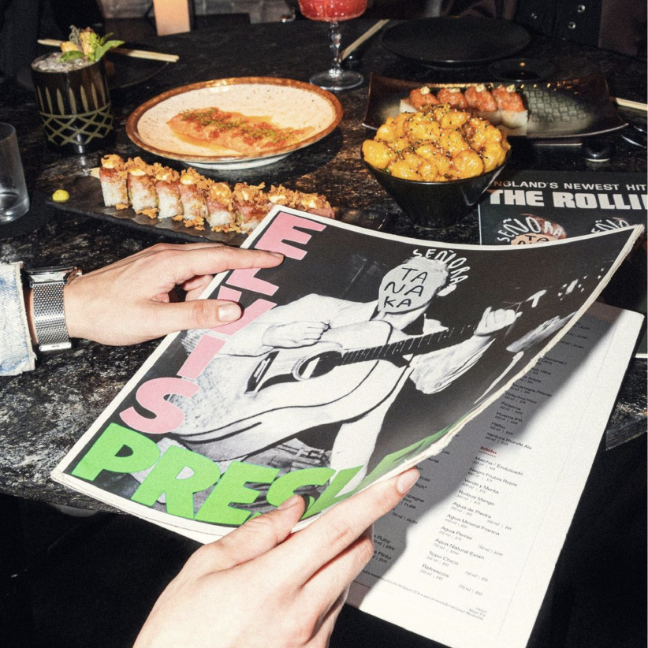
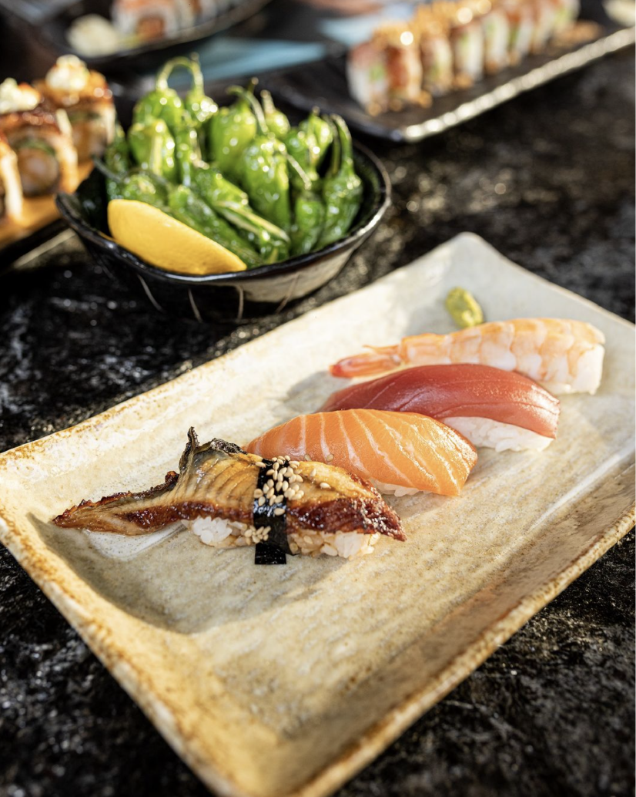

# SRA. TANAKA (Redesign DEMO) <!-- omit in toc -->
## Table of Contents <!-- omit in toc -->
- [Introduction](#introduction)
- [Codebase](#codebase)
  - [Technologies](#technologies)
  - [Folder Structure](#folder-structure)
  - [Setup Process](#setup-process)
- [Features](#features)
  - [Custom Dropdown List](#custom-dropdown-list)
  - [Side Menu](#side-menu)
  - [Intersection Observer](#intersection-observer)
  - [Gallery](#gallery)
  - [Blog](#blog)
  - [Infinite Gallery](#infinite-gallery)
  - [In-Construction](#in-construction)
- [Acknowledgements](#acknowledgements)

# Introduction
This is a mock-website for the restaurant Señora Tanaka based on the [current design](https://mandalagroup.mx/gastronomic/restaurant/senora_tanaka), where I reimagined some components and animations for an overall better UX/UI design. This project was programmed purely using vanilla JavaScript, CSS and HTML to test my JavaScript skills without relying on a framework, and to see why some members of the programming community stand by using vanilla Javascript for web development.
<br />
<p align="center">
  
</p>
<br />
<p align="center">
  <a href='https://mx-restaurant-demo.netlify.app/' >Visit Live Site</a>
</p>
<br />

# Codebase
## Technologies
This codebase consists of vanilla JavaScript, HTML and CSS.
<br />

## Folder Structure
```sh
tanaka/
├── fonts                   # Font files
├── images                  # Image and gif files
└── ...                     # Source files
```
<br />

## Setup Process
- Clone or download the repo
- Open the directory and use Live Server extension.
<br />

# Features
## Custom Dropdown List
When I first started developing this website, the first hurdle came when I needed a custom dropdown menu. Most websites utilize `<select>` tags in conjunction with `<option>` tags but these don't allow for much styling. Thus, I used other stylable HTML elements to create a customizable dropdown list.
<br />
<p align="center">
  
</p>
<br />

## Side Menu
I thought the menu that pops into view from clicking on the white side tab would make more sense if it slid into view instead of popping in. I also sped up the hover and focus animations within the menu elements for a more fluid experience. Additionally, I changed the color scheme for some elements to give it a more elegant feel.
<br />
<p align="center">
  
</p>
<br />

## Intersection Observer
For the About, Gallery, and Blog sections, I used the Intersection Observer API to trigger animations when the sections came into view. I also reimagined all the animations for these sections by playing a bit with the parallax effect, and allowed for them to be triggered each time these sections come into view, instead of only once, as many websites do.
<br />
<p align="center">
  
</p>
<br />

## Gallery
For the Gallery, I sized the images from small to big, starting from the outermost images, to give it an illusion of depth. I also resized and cropped the images as needed into a 1:1 aspect ratio to remove the stretched look. Additionally, I integrated the buttons to explore the images to the innermost focused image to give it a cleaner look.
<br />
<p align="center">
  
</p>
<br />

## Blog
For the Blog section, I gave the images different tempos for sliding in to achieve a parallax effect. Unlike the previous gallery, I did not want the blogs to loop. This means that once the last blog is in focus, the next button is removed. Similarly, when the first blog is visible, the previous button is removed from view. I deliberately chose to remove the looping feature in order to create a unique slideshow mechanic for the blog section.
<br />
<p align="center">
  
</p>
<br />

## Infinite Gallery
To provide another way to display the image gallery, I implemented a horizontally-scrolling gallery that infinitely loops the images from one end of the viewport to another. This feature adds a dynamic element to the website's design and allows for a more interactive user experience. Although it was challenging to think of a way to keep the gallery looping smoothly, I solved it by utilizing datasets to assign one of three states to each image element: before, focused, and after. The image elements are in a 'before' state `(2)` when out of view on the right side of the viewport, a 'focused' state `(0)` when sliding into view, and an 'after' state `(1)` when sliding out of view to the left.
<br />

ie.

```html
  <div class="img-slider">
    <div class="img-slide" data-order="0">
      
      
      
      
    </div>
    <div class="img-slide" data-order="1">
      
      
      
      
    </div>
    <div class="img-slide" data-order="2">
      
      
      
      
    </div>
  </div>
```
```javascript
  // Infinite Gallery
  const slideContainers = [...document.getElementsByClassName('img-slide')];

  const slideAnimation = () => {
    slideContainers.forEach( container => {
      if (parseInt(container.dataset.order) >= 2) {
        container.dataset.order = 0;
      } else {
        container.dataset.order = parseInt(container.dataset.order) + 1;
      };
    });
  };

  slideContainers.forEach( container => {
    container.addEventListener('transitionend', ({target}) => {  
      if (parseInt(target.dataset.order) >= 2) {
        target.dataset.order = 0;
      } else {
        target.dataset.order = parseInt(target.dataset.order) + 1;
      };
    });
  });

  slideAnimation();
```

<p align="center">
  
</p>
<br />

## In-Construction
As I developed this website without using any frameworks, I didn't have access to React Router for routing. To implement routing, I created a simple solution using datasets and two separate `<main>` elements containing the two sites in which the user would be redirected between depending on the section he/she desires to visit. When the user clicks on the Events (Eventos) or Jobs (Bolsa de Trabajo) tab, they are directed to an "In Construction" page without the entire site reloading itself.
<br />
<p align="center">
  
</p>
<br />

# Acknowledgements
Redesign and reimagination of the Sra. Tanaka restaurant website owned by: 
- Mandala Group

This website was done for educational purposes.